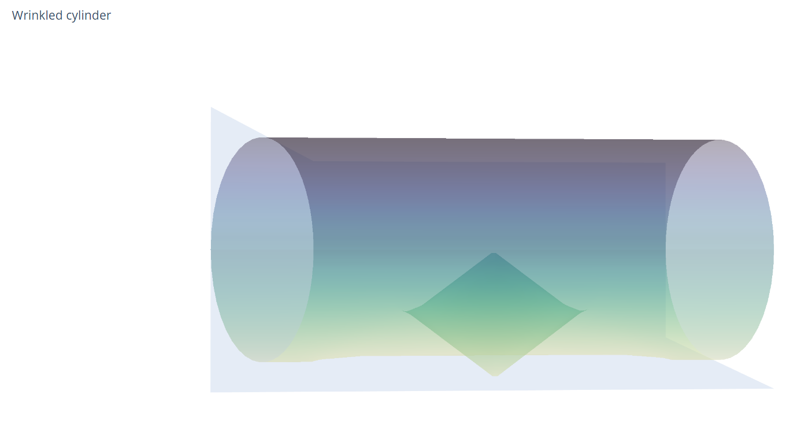
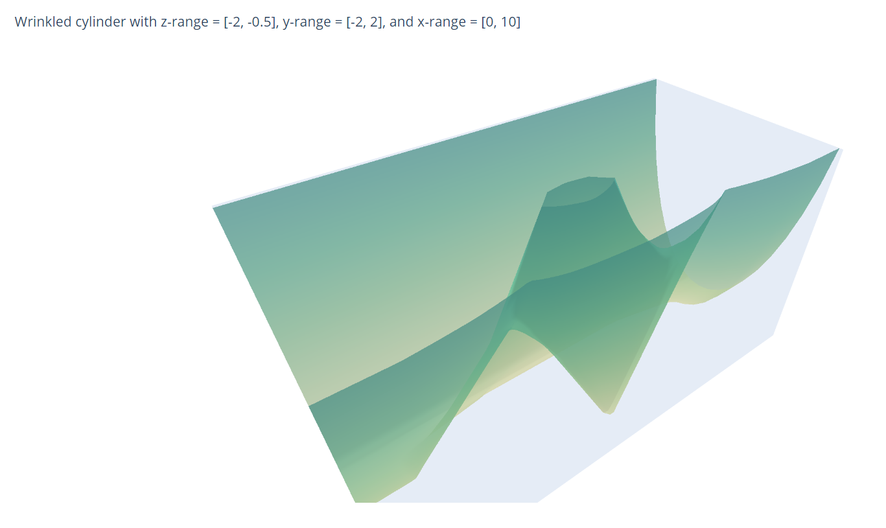

# Code for multiparameter persistence figures

A repository for creating plotly figures for understanding
multiparameter persistent homology. 

## Contents 
* The `Wrinkled_cylinder` directory contains:
  - the main code, `wrinkled_cylinder.py` for making plotly figures of the wrinkled cylinder;
  - a modified version, 'wrinkled_cylinder_with_thresh.py' for making thresholded or sliced versions of the wrinkled cylinder to better understand its persistence. For example, by just change the z-range to [-2,-0.5], one can easily see the hole in the surface, generating a first homology class (see the figure below);
  - a modified version, 'wrinkled_cylinder_slices.py' for just drawing the traces of the deformation; and
  - the 'Output_html_files' directory, containing a bunch of samples of thresholding.

* `Slider_tests` contains (deprecated) code for creating interactive versions of thresholding using native plotly and making a dash app.

* `old_tests` contains misc. old code

### Examples

The wrinkled cylinder

A thresholded version of the wrinkled cylinder.
 

### Interactive versions

I think the best intuition is obtained by messing with these in real time. Here are interactive versions of the above two static pictures. You can also find them in the above directory.

 * [Wrinkled_cylinder/Wrinkled_cylinder.html](https://rawcdn.githack.com/catanzaromj/MPFigs/293e30202cfbd950163c9af91008de8e970b6bd4/Wrinkled_cylinder/Wrinkled_cylinder.html)
 * [Wrinkled_cylinder/Wrinkled_cylinder_thresh.html](https://rawcdn.githack.com/catanzaromj/MPFigs/293e30202cfbd950163c9af91008de8e970b6bd4/Wrinkled_cylinder/Wrinkled_cylinder_thresh.html).

